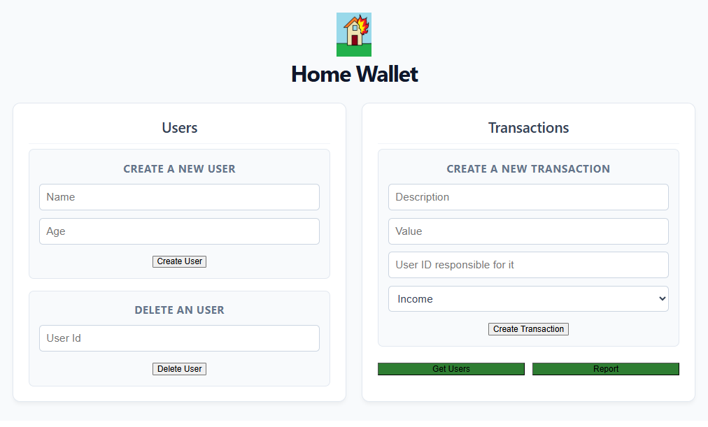
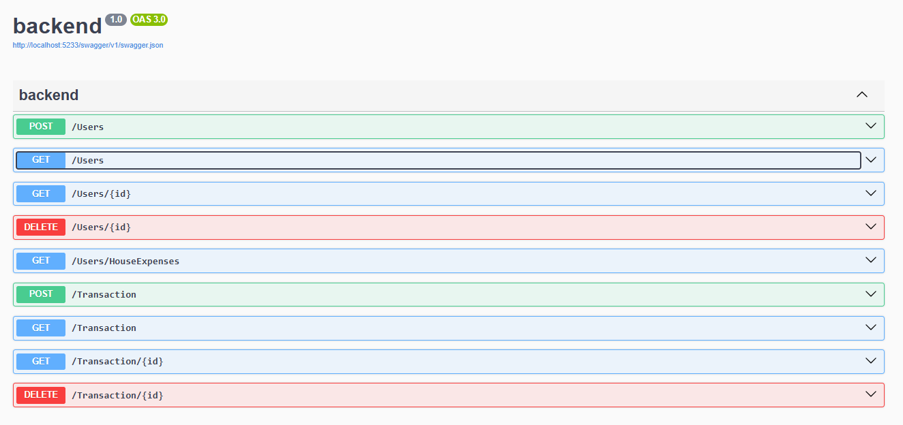

# Home-Wallet  🏠💸
Uma Web API, desenvolvida em .NET Core com React + TypeScript + CSS, paga gerenciamento de finanças domésticas.
O sistema permite cadastrar e deletar usuários, cadastrar transações financeiras (entrada ou saída) para os usuários e consulta de relatório financeiro da casa com totais (total geral de todas as pessoas, incluindo o total de receitas, o total de despesas e o saldo líquido).


[Click here to open the README.md in english](README.en.md)

---

## Tecnologias Utilizadas

* **Arquitetura:** Minimal APIs 
* **AspNetCore:** version 8.0.29 
* **EntityFrameworkCore:** version 8.0.29 
* **EntityFrameworkCore.Design:** version 8.0.29 
* **EntityFrameworkCore.Sqlite:** version 8.0.29
* **VITE:** version 8.1.5

---

## Regras de Negócio Implementadas


1. **Estrutura de Entidades:** O usuário obrigatoriamente possui `Id`, `Name` e `Age`. Um usuário pode possuir múltiplas transações financeiras (Relacionamento 1:N). Cada transação deve possuir `Id`, `Description`, `Value`, `Type` (receita ou despesa) e `UserId`, cujo deve existir na tabela de usuários para ser criado. 
2. **Validação de Maioridade:** Usuários menores de 18 anos **não podem** registrar transações do tipo `Income` (Receita), sendo permitido apenas o cadastro de `Expense` (Despesa). Caso tentem, a API retorna um HTTP `400 Bad Request`.
3. **Relatório Consolidado:** O endpoint `/Users/HouseExpenses` realiza o cálculo, retornando todas as pessoas cadastradas e suas respectivas receitas, despesas e saldo (receita – despesa) e também o total geral da casa, incluindo o total de receitas, o total de despesas e o saldo líquido.

---

## Desafios e aprendizados

- Criar `Requests` para mapear e filtrar os dados das requisições e garantir que as entradas estejam certas e não expor diretamente as entidades na rede.
- O uso de `--minimal` na criação da web API .NET, faz com que não seja preciso os `Controllers`  e podendo fazer diretamente os endpoints no arquivo principal.
- Diferente do Java as entidades não podem ter atributos do tipo `private`, senão o EF Core não consegue ler e gravar os objetos. 
- Diferente do Java, que se usa notações para mesclar as tabelas (chave primaria de uma é a chave secundária de outra), na minimal API não precisa de notação na entidade `User`, no atributo de lista de `Transactions` para que faça a relação entre as entidades.
- O uso de `await` e `async` para não gerar filas. Enquanto o banco de dados processa a conslta, outras requisições são atendidas.
- A necessidade de se criar uma classe `TransactioResponse` para que a resposta da requisição não entre em loop dentro da lista de transações que fica na entidade `Users`
- O tipo de retorno com Banco de dados deve ser do tipo `Task<List<T>>` em vez de apenas `List<T>`, devido ao assincronismo.
- O funcionamento de uma interface frontend separado do backend. Como é a primeira vez que faço os dois juntos funcionar, foi interessante aprenser a fazer essa interligação entre frontend e backend

---

## Imagens



---
## Como Executar o Projeto

### Pré-requisitos
* [.NET SDK](https://dotnet.microsoft.com/en-us/download/dotnet/8.0) instalado na sua máquina.
* [Node.js](https://nodejs.org/pt-br/download) instalado na sua máquina.
* Navegador Web (Chrome, Edge, Firefox, Brave) para visualizar o dashboard.


### Passo a Passo

1. **Clonar o repositório:**
   ```bash
   git clone https://github.com/Victor-f-Paiva/Home-wallet.git

2. **Mudar para diretório:**
   ```bash
   cd Home-wallet/backend

3. **Restaurar as dependências do projeto:**
   ```bash
   dotnet restore
   
4. **Executar as Migrations:**
   ```bash
   dotnet ef database update

5. **Rodar a aplicação:**
   ```bash
   dotnet run

6. **Mudar para diretório:**
   ```bash
   cd Home-wallet/frontend

7. **Instale as depencias fronted e rode a aplicação:**
   ```bash
   npm install
   npm run dev

8. **Abrir o navegador na porta:**
   ```bash
   http://localhost:5173/
---
## Contato
- **LinkedIn** | [linkedin.com/in/victor-paiva](https://www.linkedin.com/in/victor-paiva-b4392ab7/) 
- **GitHub** | [github.com/Victor-f-Paiva](https://github.com/Victor-f-Paiva) 
- **E-mail** | [victor_eduardof@hotmail.com](mailto:victor_eduardof@hotmail.com) 